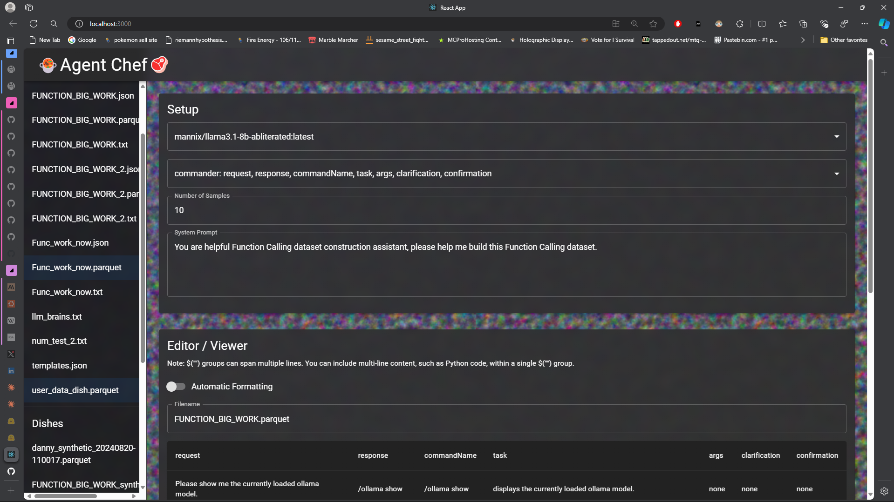
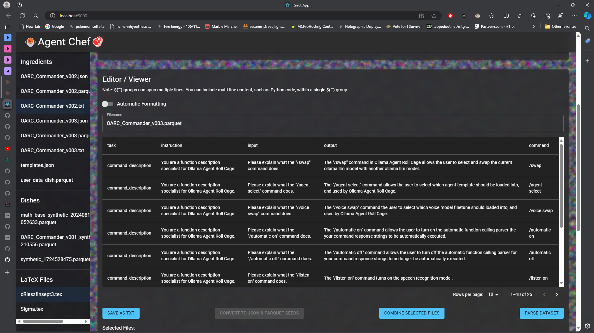

# 🍲Agent Chef (AC) V0.1.1🥘

  
  

🍲Agent Chef is a powerful tool designed for dataset refinement, structuring, and generation. It empowers users to create high-quality, domain-specific datasets for fine-tuning AI models.🥘

## Features

- 🥕**Dataset Refinement**🥩:
  - Clean and refine your existing datasets
- 🥣**Synthetic Data Generation**🥣:
  - Create procedural and synthetic datasets
- 🔪**Data Poisoning Elimination**🔪:
  - Identify and remove low-quality or malicious data
- 🍛**Specialized Dataset Construction**🍛:
  Generate datasets for specific use cases, including:
  - Function-calling
  - Programming: Python, React, C++
  - Mathematics: LaTeX, Python
  - Languages, Physics, Biology, Chemistry, Law, Cooking, wikipedias, history, context, and more!

## Setup
Start by selecting your ollama model, system prompt, number of duplicates, and the parquet column template format.

## Procedural construction
After setup, manually construct your dataset group formatting by wrapping each data point in $("data") wrappers.

  
These group tags allow agent chef to splice the data out into the correct parquet cells for dataset construction. The automatic formatting tool is currently experimental however it attempts to generate the $("data") tags from the template formatting and inference. Only use this feature if you are daring. 
  [Insert Image]
  
## Synthetic Generation
After procedural dataset construction is complete, you can move on to generating the synthetic dataset from the procedural parquet.
  [Insert Image]
  
## Why Agent Chef?

Agent Chef aims to revolutionize home-brewed AI by providing tools and frameworks that enable users to create high-quality, domain-specific datasets. Whether you're looking to improve an existing dataset or generate new data from scratch, Agent Chef has you covered.

## Getting Started

[Instructions on how to install and set up Agent Chef]

## Usage

[Basic usage instructions and examples]

Agent Chef: Cooking up better datasets for a smarter AI future!
