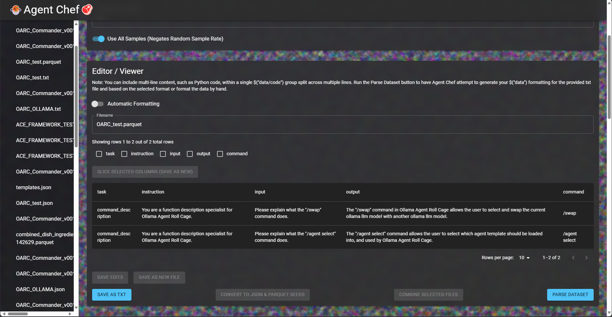
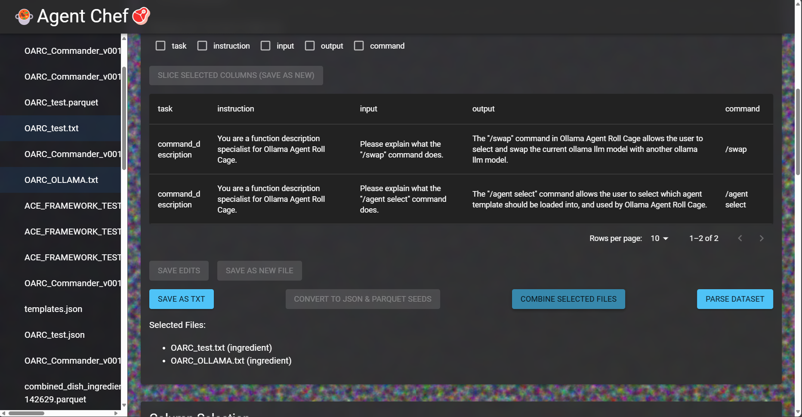

<p align="center">
  
</p>
<p align="center">
  <a href="https://ko-fi.com/theborch"></a>
  <a href="https://discord.gg/dAzSYcnpdF"></a>
</p>

# 🍲Agent Chef (AC) V0.1.43🥘
***[🦾Borch's AI Development Guide🦿](https://share.note.sx/c3topc9y#iaFb281+b0x66J+2lWIhWp4PV+wwoKsd5GqoXYg1i4I)***   ***[🦙 Ollama Discord Server 🦙](https://discord.gg/ollama)***   ***[🤖 OARC V0.28 VIDEO GUIDE 🧙](https://www.youtube.com/watch?v=W7TusPTnNXA)***

🍲Agent Chef is a powerful tool designed for dataset refinement, structuring, and generation. It empowers users to create high-quality, domain-specific datasets for fine-tuning AI models.🥘

## Features

- 🥕**Dataset Refinement**🥩:
  - Clean and refine your existing datasets
- 🥣**Synthetic Data Generation**🥣:
  - Create procedural and synthetic datasets
- 🔪**Data Poisoning Elimination**🔪:
  - Identify and remove low-quality or malicious data
- 🍛**Specialized Dataset Construction**🍛:
  Generate datasets for specific use cases, including:
  - Function-calling
  - Programming: Python, React, C++
  - Mathematics: LaTeX, Python
  - Languages, Physics, Biology, Chemistry, Law, Cooking, wikipedias, history, context, and more!

## Setup
Start by selecting your ollama model, system prompt, number of duplicates, and the parquet column template format.


## Procedural construction
After setup, manually construct your dataset group formatting by wrapping each data point in $("data") wrappers.
```
$("command_description")
$("Instruction")
$("Input")
$("Output")
$("Command")

$("command_description")
$("Instruction")
$("Input")
...
For each datapoint in the parquet
```


then press "convert to json and parquet seeds", to enjoy your hand constructed dataset.


  


You can now see from the $("") txt dataset provided, we have built the parquet with the structure of the template. Unsloth will utilize the instruction, input, and output columns for training the model, and the command description and command colloumns are used as reference arguments for construction, create your own custom args for custom dataset construction! You can track which model generated a specific datapoint and then you can know in synthetic datasets what serperate models contributed to that set.


you can also select 2 files and combine them:


  
## Synthetic Generation & Data Augmentation

After creating a procedural dataset, you can move on to generating a synthetically augmented dataset from the procedural/hand-made parquet in the previous step.

Once you have selected a parquet to augment, you will select which columns will be static, dynamic, and reference:

```
static - column remains unchanged in the augmented dataset
dynamic - column receives augmention via the column reference agent and the task description prompts which denote how the llm will generate the dataset points, and how it will leverage the reference data when constructing this dataset augmentation:
reference - column is used as the reference value when the dataset augmentation assistant generates new question answer pairs, this column is leveraged for input, and is provided to the verification assistant to ensure it was used.
```


Next you will define the follow prompts for you dataset augmentation agent:
```
Dataset Augmentation Assisant -
  System Prompt
  Input Datapoint augmentation assistant
    System Prompt
    User Prompt
  Output Datapoint augmentation assistant
    System Prompt
    User Prompt
```


  
After designing your dataset augmentation assistant hit "Generate Synthetic Data", and check the backend terminal to watch the dataset generated by prompting the select ollama model, to augment your dataset and expand it x10, x100, x1000, x10000000...


here you can see the comparison of a complete set of 25 commands for OARC described in 25 rows:


we now can see after select 360 paraphrases per Sample we have generated 360x25 = 9000 datapoints to train our our commander model on these 25 datapoint:


now that you have generated a training dataset, you must generate a sufficiently varied evaluation datasets, for my example I changed the dataset augmenter to say "Hey whats up.. " before every response, ultimately your eval set cannot match your train set, then once you have train and eval sets you must build a test set, utilizing the splice feature you can take and existing dataset, and splice out the output column to create a test set. Once you have these 3 sets you are ready to train a LORA adapter with unsloth that you will be able to merge into the base model.
  
## Why Agent Chef?

Agent Chef aims to revolutionize home-brewed AI by providing tools and frameworks that enable users to create high-quality, domain-specific datasets. Whether you're looking to improve an existing dataset or generate new data from scratch, Agent Chef has you covered.

## Agent Chef Installation Guide

### Prerequisites:

#### Windows Users:
1. Install Windows Subsystem for Linux (WSL):
   * Follow the official Microsoft guide to install WSL: https://learn.microsoft.com/en-us/windows/wsl/install
   * After installation, open a WSL terminal for the next steps.

#### Linux Users:
* Skip the WSL installation step.

### Installation Steps:

1. Install Miniconda:
   Open a terminal and run the following commands:

   ```bash
   cd ~
   mkdir -p ~/miniconda3
   wget https://repo.anaconda.com/miniconda/Miniconda3-latest-Linux-x86_64.sh -O ~/miniconda3/miniconda.sh
   bash ~/miniconda3/miniconda.sh -b -u -p ~/miniconda3
   rm ~/miniconda3/miniconda.sh
   ```

   Add Miniconda to your PATH:

   ```bash
   echo 'export PATH="$HOME/miniconda3/bin:$PATH"' >> ~/.bashrc
   source ~/.bashrc
   ```

2. Create and Activate Conda Environment:

   ```bash
   conda create -n AgentChef python=3.11 -y
   close and reopen terminal
   conda activate AgentChef
   ```

3. Clone the Repository INTO HOME FOLDER:

   ```bash
   cd ~
   MAKE SURE YOU ARE IN YOUR CD HOME WHEN YOU CLONE AGENT_CHEF
   (AgentChef) user@name:/home$
   git clone https://github.com/Leoleojames1/Agent_Chef.git
   cd Agent_Chef
   ```

4. Install Dependencies:

   ```bash
   bash AgentChef_install.sh
   pip install -r requirements.txt
   ```

5. Install Node.js and npm:
   
   ```bash
   curl -fsSL https://deb.nodesource.com/setup_lts.x | sudo -E bash -
   sudo apt-get install -y nodejs
   ```

6. Install React App Dependencies:

   ```bash
   cd react-app
   npm cache clean --force
   rm -rf node_modules package-lock.json
   npm install
   cd ..
   ```

   If you encounter permission issues, run:

   ```bash
   sudo chown -R $(whoami) ~/.npm
   sudo chown -R $(whoami) ~/Agent_Chef/react-app
   ```

7. Setup Hugging Face and C++ Compiler:

   ```bash
   pip install huggingface_hub
   huggingface-cli login --token YOUR_TOKEN_HERE
   conda install -c conda-forge gcc_linux-64 gxx_linux-64 -y
   gcc --version
   ```

   Replace `YOUR_TOKEN_HERE` with your actual Hugging Face token.

## Usage:

To run Agent Chef:

1. Navigate to the Agent Chef directory:

   ```bash
   cd ~/Agent_Chef
   ```

2. Activate the conda environment:

   ```bash
   conda activate AgentChef
   ```

3. Run the application:

   ```bash
   bash AgentChef_run.sh
   ```

## Troubleshooting:

If you encounter issues with the React app:

1. Ensure you're using the correct Node.js version:
   ```bash
   node --version
   ```
   If it's not v14 or higher, update Node.js.

2. If you see "ENOTEMPTY" errors, try:
   ```bash
   cd ~/Agent_Chef/react-app
   rm -rf node_modules
   npm cache clean --force
   npm install
   ```

3. If you encounter permission issues:
   ```bash
   sudo chown -R $(whoami) ~/.npm
   sudo chown -R $(whoami) ~/Agent_Chef/react-app
   ```

4. If the React app fails to start, try running it manually:
   ```bash
   cd ~/Agent_Chef/react-app
   npm start
   ```
   This will provide more detailed error messages if there are issues.

If problems persist, please open an issue on the GitHub repository with the full error message and the output of `npm --version` and `node --version`.

## Important Note for WSL and Windows Users

If you use both WSL and Windows environments to run Ollama & Unsloth, you may encounter the following error when trying to run Ollama on Windows after using it in WSL:

```
Error: listen tcp 127.0.0.1:11434: bind: Only one usage of each socket address (protocol/network address/port) is normally permitted.
```

### How to Fix:

If you encounter this error, it means Ollama is still running in your WSL environment and blocking the port on your Windows host. To resolve this:

1. Open your WSL terminal.

2. Stop the Unsloth or Ollama service in WSL by running:

   ```bash
   sudo service ollama stop
   or
   sudo service unsloth stop
   ```

3. You can now close the WSL terminal and return to Windows.

4. Try running Ollama in Windows again:

   ```
   ollama serve
   ```

This should resolve the port conflict and allow you to run Ollama on Windows.

### Prevention:

To avoid this issue in the future, always remember to stop the Ollama service in WSL before closing your WSL session if you plan to use Ollama on Windows afterwards.

### Note:

If you primarily use Ollama in one environment (either WSL or Windows), consider using it exclusively in that environment to avoid such conflicts.
